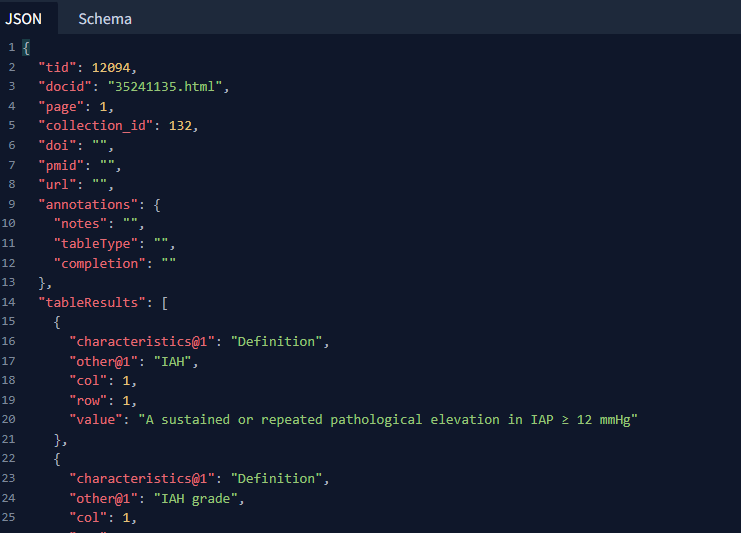
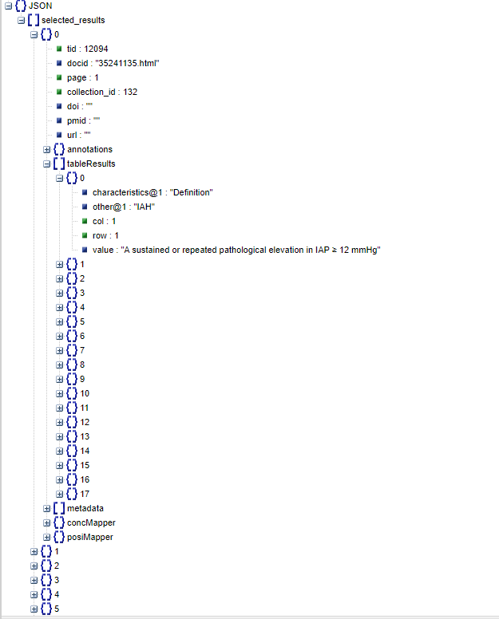
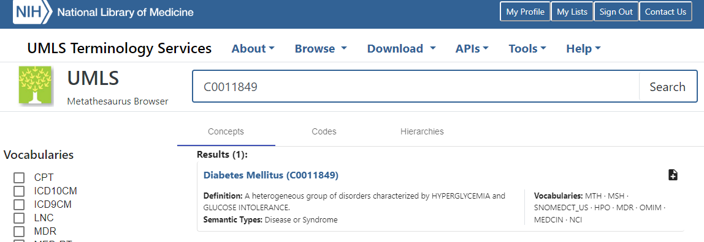

```{r setup, include=FALSE}
knitr::opts_chunk$set(echo = TRUE)
```

```{r echo=FALSE, warn=FALSE, message=FALSE}
source("restructuring.R")
```

# tldr

**R user?** The functions in [restructuring.R](/restructuring.R) are designed to help you work with the json outputs from TableTidier.

**Not an R user?** If you are not an R user, you can convert the json collection files into a variety of formats in a [shiny app we have put together](https://ihwph-hehta.shinyapps.io/TableTidierOutputsShiny/). The Shiny app does not have the ability to map between terminology and data. For that you will need to use functions below.

# Conventions in this document

To distinguish between tables in TableTidier and data tables in `R` we refered to the collection of outputs for a given TableTidier table as a *table object* and refer to data tables in R (as is conventional in the R literature) dataframes.

# Reason for using json

We used json because it allows more flexible data structures than do flat files such as comma-separated value files (CSV) or tab-delimited files. At the same time, json files can be readily converted into flat files (or dataframes/tables) reasonably straightforwardly using R packages (or their equivalents in other software). If you are familiar with lists in R, you can think of json files as nested lists stored in text files.

Although json fils can be opened in a standard text editor (eg notepad) these are difficult for a human to read. For example the first 200 characters of the json file for a collection looks like this.

```{r rawjson}
read_lines("collection_132_all.json") %>% str_sub(1,200)
```

However, it looks a little better in a text editor with json support.



It looks better still if you paste a json file such as "collection_123_all.json" into json viewer (just google to find one). In the snapshot below you can see the list structure quite clearly. For our json files, the highest level of structure is each table object. Within each table object there are sections for information, notes, data and terminology. There are also objects which allow us to map between data and terminology.



# Conversion into R objects

It is quite straightforward to convert these into R objects (nested lists) using the `R` `jsonlite` package. The package also has functions that will automatically simplify the objects into, for example, dataframes and vectors. However, many people are not comfortable with nested lists, and even among those who are, almost all will be unfamiliar with the structure of json files that TableTidier produces. Therefore, we have created a set of helper functions to work with TableTidier json files. The following demonstrates their usage.

# Reading in collections

Collections can be read in as follows. The whole file is read in as a list object and the information for each table object is printed.

```{r readcollection}
clctn <- ReadCollection("collection_132_all_additional.json")
```

We can interrogate the object read in to find out more. It is essentially a list.

```{r objclass}
class(clctn)

```

At the top level of this particular collection there are 6 tables, named by the table object IDs (TIDs).

```{r clcntlvl}
names(clctn)
```

Within a single table object we have table object information (tid, docid, page, collection_id, doi, pmid and url), annotations, data (tableResults), terminology (metadata) and list objects to allow mapping between the data and terminology (concMapper and posiMapper).

```{r tlblvl}
names(clctn$TID12094)
```

The "information" fields were printed when we read in the collection. You can also access these as a dataframe using the function `ConvertInfo`.

```{r convertinfo}
knitr::kable(ConvertInfo(clctn))
```

Finally, at the collection level it is also useful to extract annotations into a dataframe.

```{r concertnotes}
knitr::kable(ConvertNotes(clctn))
```

# Extracting data

For extracting data into more usable R objects it makes sense to do so for individual tables as well as for collections. We can extract data for single tables thus.

```{r convertdata}
# Print first 6 rows only
knitr::kable(ConvertData(clctn$TID12095) %>% head())
```

We can also extract data for the whole collection at once using `map` (or if preferred base `R` can use `lapply` ).

```{r convertdatawhole}
# print first row only
map(clctn, ~ ConvertData(.x) %>% head(1))
```

# Extracting terminology

As with data, it makes sense to extract terminology both for a single table object

```{r convertterminology}
# print first 6 rows only
knitr::kable(ConvertTerminology(clctn$TID12095) %>% 
  head())
```

and for a collection (or subset of a collection). Since terminology tables are always in the same format, it often makes sense to bind these into a single dataframe after extracting them.

```{r converttermwhole}
# print first 6 rows
map(clctn, ~ ConvertTerminology(.x)) %>% 
  bind_rows(.id = "tid") %>% 
  slice(1:6) %>% 
  knitr::kable()
```

The functions in this repository show the concept IDs only. They do not pull information associated with concept IDs such as preferred terms, source databases etc from the [UMLS Metathesaurus](https://www.nlm.nih.gov/research/umls/knowledge_sources/metathesaurus/index.html). The reason for this is that UMLS requires a (free) licence.

If you want to obtain this information for the selected concept IDs you can use the [UMLS browser](https://uts.nlm.nih.gov/uts/umls/home).



If you want to obtain this information programmatically in R you can use the [rUMLS](https://github.com/mpancia/rUMLS) or [umlsr](https://gitlab.com/dkincaid/umlsr) packages both of [which are mentioned on the UMLS user contributions webpage](https://www.nlm.nih.gov/research/umls/implementation_resources/community/index.html) alongside code for other software. Both packages:-

-   use the UMLS API

-   require a UMLS log-in which is free, but which requires you to sign a licence

-   allow you to log into your own UMLS account via a personal API key (which is also free if you have a UMLS log in)

# Mapping between data and terminology

As well as allowing us to nest tables within collections, one of the main motivations for using json files was to preserve the relationship between the data and the terminology. One might want to do so in order to pull all the data related to a given variable.

Lookups between data and terminology are provided via the `concMapper` and `posiMapper` list objects. To simplify their use we have provided the helper functions `ConvertDataTerm,` `SearchConcepts`, `GetCuis` and `GetDataRowsCols`. First we describe how to use these functions. Subsequently, for those interested we explain the structures of `concMapper` and `posiMapper` in more detail.

## Combining all terminology with data

The simplest approach is to run the function `ConvertDataTerm`. This takes a table object and produces a dataframe with the data and additional column(s) with the selected UMLS concept IDs. It can map any columns from the terminology dataframe (the output produced by the `ConvertTerminology` function) to the data dataframe. It might make sense to first review the output of `ConvertData` and `ConvertTerminology` before running `ConvertDataTerm`.

```{r convertdataterm}
ConvertDataTerm(clctn$TID12095) %>% head() %>% knitr::kable()
```

## Approach using SearchConcepts, GetCuis and GetDataRowsCols

We simplify mapping between terminology and data using the functions SearchConcepts, GetCuis and GetDataRowsCols.

First we search for concepts with text or a concept ID we are interested in. It will often make sense to do this after browsing the terminology tables created by `ConvertTerminology` or looking at the tables on TableTidier itself. Assuming we have an idea of what concepts were are intersted in we can search. We can search either using a concept ID or string.

First we can search for a string, in this case blood pressure. The search is a regular expression search so is by default case sensitive.

```{r showsearch}
res <- SearchConcepts(clctn$TID12078, cutext = "pressure")
res
```

We could also have found this using the concept ID

```{r showsearch2}
res <- SearchConcepts(clctn$TID12078, cuis = "C0005823")
res
```

Next we can use this number to identify which original rows and columns the concept relates to.

```{r showrc}
res_r_c <- GetDataRowsCols(clctn$TID12078, res)
res_r_c %>% 
  knitr::kable()
```

Finally, we can obtain the relevant data by joining the above dataframe to the data dataframe by rows and columns.

```{r getdata}
mydf <- ConvertData(clctn$TID12078)
mydf %>% 
  semi_join(res_r_c) %>% 
  knitr::kable()
```

## Mapping between data and terminology for multiple tables

If comfortable using `map` or `lapply`, it is also straightforward to pull multiple tables at once.

```{r multipleconcepts}
search_res <- map(clctn, function(each_tbl){
  SearchConcepts(each_tbl, cutext = "Placebo")
})
# take only those tables with a Placebo concept
clctn_slct <- clctn[map_lgl(search_res, ~ length(.x) >=1 )]
names(clctn_slct)

```

Having limited the collection to those tables with the information, we can loop over these pulling the relevant rows and columns

```{r multipleconcepts2, message = FALSE}
map(clctn_slct, function(each_tbl){
  res <- SearchConcepts(each_tbl, cutext = "Placebo")
res_r_c <- GetDataRowsCols(each_tbl, res)
mydf <- ConvertData(each_tbl)
mydf %>% 
  semi_join(res_r_c) %>% 
  slice(1)
})
```

## Mapping from data to terminology

We can of course also map in the other direction, from data to terminology. First getting the relevant row and column.

```{r getcuis1}
ConvertData(clctn$TID12078) %>% slice(17) %>% knitr::kable()
```

Then viewing the concepts for the row and column.

```{r getcuis2}
GetCuis(clctn$TID12078, row = 12, col = 2) %>% knitr::kable()
```

# Detail on `concMapper` and `posiMapper`

The following is only for those interested in more detail on how `concMapper` and `posiMapper` work. `concMapper` contains each original text label and its index. Since this was created in javascript, the indexing starts at zero rather than at one (R is unusual in starting its indexing at one). The following shows the first 6 items in the `concmapper` list for one of the tables.

```{r concmapper}
clctn$TID12095$concMapper %>% head()
```

`posiMapper` is more complex, it contains each each original text label and its index. Since this was created in javascript, the indexing starts at zero rather than at one (R is unusual in starting its indexing at one).

The posiMapper list has one element for each column at the highest level.

```{r posimapper}
a <- clctn$TID12095$posiMapper
names(a)
```

Within each column there is an entry for each row.

```{r posimapper_r}
length(a[[1]])
```

For each of these there is an entry for each text label corresponding to the terminology labelling.

```{r posimapper_rc}
a$`1`$`2`$`Sex (m/f)`
a$`1`$`2`$`Neostigmine (n = 40)`
```

If we examine the data and terminology for this row and column we can see how these lists allow us to map across between terminology and data.

```{r posimapper_eg}
ConvertData(clctn$TID12095) %>% filter(col == 1, row == 2) %>% 
  knitr::kable()
ConvertTerminology(clctn$TID12095)  %>% slice(c(1, 40)+1) %>% 
  knitr::kable()
```

# Updates

TableTidier is evolving in response to user feedback. As such, and to add functionality the code in this repository is likely to change too. Therefore, if using these functions with TableTidier it is worth storing both your collection json files and these R functions at the timepoint of your succesful analysis. This will help with reproducibility. Since both the json collection and [restructuring.R](/restructuring.R) are text files, it is straightforward to store both using git-based version control.

# Suggestions and contributions

If you would like to make a contribution to this repository (or TableTidier itself) please raise an issue. If anyone has written equivalent functions in Python, these would be particularly welcome.
