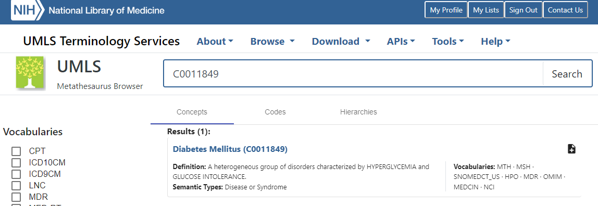

Working with tabletidier outputs
================
2023-08-18

# tldr

**R user?** The functions in [restructuring.R](/restructuring.R) are
designed to help you work with the json outputs from TableTidier.

**Not an R user?** If you are not an R user, you can convert the json
collection files into a variety of formats in a [shiny app we have put
together](https://ihwph-hehta.shinyapps.io/TableTidierOutputsShiny/).
The Shiny app does not have the ability to map between terminology and
data. For that you will need to use functions below.

# Conventions in this document

To distinguish between tables in TableTidier and data tables in `R` we
refered to the collection of outputs for a given TableTidier table as a
*table object* and refer to data tables in R (as is conventional in the
R literature) dataframes.

# Reason for using json

We used json because it allows more flexible data structures than do
flat files such as comma-separated value files (CSV) or tab-delimited
files. At the same time, json files can be readily converted into flat
files (or dataframes/tables) reasonably straightforwardly using R
packages (or their equivalents in other software). If you are familiar
with lists in R, you can think of json files as nested lists stored in
text files.

Although json fils can be opened in a standard text editor (eg notepad)
these are difficult for a human to read. For example the first 200
characters of the json file for a collection looks like this.

``` r
read_lines("collection_132_all.json") %>% str_sub(1,200)
```

    ## [1] "{\"selected_results\":[{\"tid\":12078,\"docid\":\"NCT03643965.html\",\"page\":1,\"collection_id\":132,\"doi\":\"https://doi.org/10.1016/S0140-6736(23)01554-4\",\"pmid\":\"\",\"url\":\"\",\"annotations\":{\"notes\":\"\",\"tableType\""

However, it looks a little better in a text editor with json support.

<figure>

<figcaption aria-hidden="true">Snapshot of collection using a json text
editor</figcaption>
</figure>

It looks better still if you paste a json file such as
“collection_123_all.json” into json viewer (just google to find one). In
the snapshot below you can see the list structure quite clearly. For our
json files, the highest level of structure is each table object. Within
each table object there are sections for information, notes, data and
terminology. There are also objects which allow us to map between data
and terminology.

<figure>

<figcaption aria-hidden="true">Snapshot of collection using a json
viewer</figcaption>
</figure>

# Conversion into R objects

It is quite straightforward to convert these into R objects (nested
lists) using the `R` `jsonlite` package. The package also has functions
that will automatically simplify the objects into, for example,
dataframes and vectors. However, many people are not comfortable with
nested lists, and even among those who are, almost all will be
unfamiliar with the structure of json files that TableTidier produces.
Therefore, we have created a set of helper functions to work with
TableTidier json files. The following demonstrates their usage.

# Reading in collections

Collections can be read in as follows. The whole file is read in as a
list object and the information for each table object is printed.

``` r
clctn <- ReadCollection("collection_132_all_additional.json")
```

    ## # A tibble: 7 × 7
    ##     tid docid             page collection_id doi                     pmid  url  
    ##   <int> <chr>            <int>         <int> <chr>                   <chr> <chr>
    ## 1 12094 35241135.html        1           132 ""                      ""    ""   
    ## 2 12095 35241135.html        2           132 "10.1186/s13054-022-03… "352… "htt…
    ## 3 12096 35241135.html        4           132 ""                      "352… ""   
    ## 4 12097 35241135.html        3           132 ""                      "352… ""   
    ## 5 12078 NCT03643965.html     1           132 "https://doi.org/10.10… ""    ""   
    ## 6 12079 NCT03643965.html     2           132 "https://doi.org/10.10… ""    ""   
    ## 7 12080 NCT03643965.html     3           132 "https://doi.org/10.10… ""    ""

We can interrogate the object read in to find out more. It is
essentially a list.

``` r
class(clctn)
```

    ## [1] "list"

At the top level of this particular collection there are 6 tables, named
by the table object IDs (TIDs).

``` r
names(clctn)
```

    ## [1] "TID12094" "TID12095" "TID12096" "TID12097" "TID12078" "TID12079" "TID12080"

Within a single table object we have table object information (tid,
docid, page, collection_id, doi, pmid and url), annotations, data
(tableResults), terminology (metadata) and list objects to allow mapping
between the data and terminology (concMapper and posiMapper).

``` r
names(clctn$TID12094)
```

    ##  [1] "tid"           "docid"         "page"          "collection_id"
    ##  [5] "doi"           "pmid"          "url"           "annotations"  
    ##  [9] "tableResults"  "metadata"      "concMapper"    "posiMapper"

The “information” fields were printed when we read in the collection.
You can also access these as a dataframe using the function
`ConvertInfo`.

``` r
knitr::kable(ConvertInfo(clctn))
```

|   tid | docid            | page | collection_id | doi                                             | pmid     | url                                                     |
|------:|:-----------------|-----:|--------------:|:------------------------------------------------|:---------|:--------------------------------------------------------|
| 12094 | 35241135.html    |    1 |           132 |                                                 |          |                                                         |
| 12095 | 35241135.html    |    2 |           132 | 10.1186/s13054-022-03922-4                      | 35241135 | <https://www.ncbi.nlm.nih.gov/pmc/articles/PMC8892692/> |
| 12096 | 35241135.html    |    4 |           132 |                                                 | 35241135 |                                                         |
| 12097 | 35241135.html    |    3 |           132 |                                                 | 35241135 |                                                         |
| 12078 | NCT03643965.html |    1 |           132 | <https://doi.org/10.1016/S0140-6736(23)01554-4> |          |                                                         |
| 12079 | NCT03643965.html |    2 |           132 | <https://doi.org/10.1016/S0140-6736(23)01554-4> |          |                                                         |
| 12080 | NCT03643965.html |    3 |           132 | <https://doi.org/10.1016/S0140-6736(23)01554-4> |          |                                                         |

Finally, at the collection level it is also useful to extract
annotations into a dataframe.

``` r
knitr::kable(ConvertNotes(clctn))
```

| tid      | notes | tableType      | completion |
|:---------|:------|:---------------|:-----------|
| TID12094 |       |                |            |
| TID12095 |       | baseline_table |            |
| TID12096 |       | results_table  |            |
| TID12097 |       | results_table  |            |
| TID12078 |       | baseline_table |            |
| TID12079 |       | results_table  |            |
| TID12080 |       | results_table  |            |

# Extracting data

For extracting data into more usable R objects it makes sense to do so
for individual tables as well as for collections. We can extract data
for single tables thus.

``` r
# Print first 6 rows only
knitr::kable(ConvertData(clctn$TID12095) %>% head())
```

| <characteristics@1> | <characteristics@2> | <arms@1>              | col | row | value   |
|:--------------------|:--------------------|:----------------------|----:|----:|:--------|
|                     | Age (year)          | Neostigmine (n = 40)  |   1 |   1 | 46 ± 13 |
|                     | Age (year)          | Conventional (n = 40) |   2 |   1 | 49 ± 14 |
|                     | Age (year)          | P value               |   3 |   1 | 0.85    |
|                     | Sex (m/f)           | Neostigmine (n = 40)  |   1 |   2 | 27/13   |
|                     | Sex (m/f)           | Conventional (n = 40) |   2 |   2 | 34/6    |
|                     | Sex (m/f)           | P value               |   3 |   2 | 0.11    |

We can also extract data for the whole collection at once using `map`
(or if preferred base `R` can use `lapply` ).

``` r
# print first row only
map(clctn, ~ ConvertData(.x) %>% head(1))
```

    ## $TID12094
    ##   characteristics@1 other@1 col row
    ## 1        Definition     IAH   1   1
    ##                                                             value
    ## 1 A sustained or repeated pathological elevation in IAP ≥ 12 mmHg
    ## 
    ## $TID12095
    ##   characteristics@1 characteristics@2               arms@1 col row   value
    ## 1                          Age (year) Neostigmine (n = 40)   1   1 46 ± 13
    ## 
    ## $TID12096
    ##                 arms@1            times@1 outcomes@1
    ## 1 Neostigmine (n = 40) Follow up 24 hours           
    ##                         outcomes@2 col row                     value
    ## 1 Percent change of IAP at 24 h, %   2   2 − 18.7 ([− 28.4]-[− 4.7])
    ## 
    ## $TID12097
    ##                       other@1               arms@1 measures@1 times@1 col row
    ## 1 Intention-to-treat analysis Neostigmine (n = 40)        IAP       0   1   3
    ##        value
    ## 1 16.3 ± 2.7
    ## 
    ## $TID12078
    ##                      arms@1 characteristics@1 characteristics@2 col row
    ## 1 Nefecon 16 mg/day (n=182)        Age, years                     2   1
    ##        value
    ## 1 43 (36–50)
    ## 
    ## $TID12079
    ##                                                                   measures@1
    ## 1 Number (%) of patients with confirmed 30% eGFR reduction or kidney failure
    ##             arms@1                                          other@1 col row
    ## 1 Nefecon16 mg/day Full analysis set (Nefecon n=182; placebo n=182)   2   2
    ##      value
    ## 1 21 (12%)
    ## 
    ## $TID12080
    ##                    times@1                    arms@1
    ## 1 9-month treatment period Nefecon 16 mg/day (n=182)
    ##                       characteristics@1 characteristics@2 col row     value
    ## 1 All treatment-emergent adverse events                     2   2 159 (87%)

# Extracting terminology

As with data, it makes sense to extract terminology both for a single
table object

``` r
# print first 6 rows only
knitr::kable(ConvertTerminology(clctn$TID12095) %>% 
  head())
```

| concept_source | concept_root | concept                 | cuis                                                                             | qualifiers | cuis_selected | qualifiers_selected | istitle | labeller |
|:---------------|:-------------|:------------------------|:---------------------------------------------------------------------------------|:-----------|:--------------|:--------------------|:--------|:---------|
|                |              | Age (year)              | C0001779;C0439234;C0439508                                                       |            | C0001779      |                     | FALSE   | NA       |
|                |              | Sex (m/f)               | C0009253;C0036864;C0079399;C0804628;C1314687;C1522384;C1306057                   |            | C0079399      |                     | FALSE   | NA       |
|                |              | ACS                     | C0742343;C4318612;C0948089                                                       |            | C0948089      |                     | FALSE   | NA       |
|                |              | Use of opioids          | C1524063;C0002772;C0242402                                                       |            | C0002772      |                     | FALSE   | NA       |
|                |              | Colonic ileusc,d        | C0073187;C0332173;C4484261;C0009368                                              |            | C0009368      |                     | FALSE   | NA       |
|                |              | 24 h of defecation (mL) | C0439526;C1705224;C3887665;C0033727;C0369286;C0441932;C0564385;C4528284;C0011135 |            | C0011135      |                     | FALSE   | NA       |

and for a collection (or subset of a collection). Since terminology
tables are always in the same format, it often makes sense to bind these
into a single dataframe after extracting them.

``` r
# print first 6 rows
map(clctn, ~ ConvertTerminology(.x)) %>% 
  bind_rows(.id = "tid") %>% 
  slice(1:6) %>% 
  knitr::kable()
```

| tid      | concept_source | concept_root | concept                 | cuis                                                                             | qualifiers | cuis_selected | qualifiers_selected | istitle | labeller |
|:---------|:---------------|:-------------|:------------------------|:---------------------------------------------------------------------------------|:-----------|:--------------|:--------------------|:--------|:---------|
| TID12095 |                |              | Age (year)              | C0001779;C0439234;C0439508                                                       |            | C0001779      |                     | FALSE   | NA       |
| TID12095 |                |              | Sex (m/f)               | C0009253;C0036864;C0079399;C0804628;C1314687;C1522384;C1306057                   |            | C0079399      |                     | FALSE   | NA       |
| TID12095 |                |              | ACS                     | C0742343;C4318612;C0948089                                                       |            | C0948089      |                     | FALSE   | NA       |
| TID12095 |                |              | Use of opioids          | C1524063;C0002772;C0242402                                                       |            | C0002772      |                     | FALSE   | NA       |
| TID12095 |                |              | Colonic ileusc,d        | C0073187;C0332173;C4484261;C0009368                                              |            | C0009368      |                     | FALSE   | NA       |
| TID12095 |                |              | 24 h of defecation (mL) | C0439526;C1705224;C3887665;C0033727;C0369286;C0441932;C0564385;C4528284;C0011135 |            | C0011135      |                     | FALSE   | NA       |

The functions in this repository show the concept IDs only. They do not
pull information associated with concept IDs such as preferred terms,
source databases etc from the [UMLS
Metathesaurus](https://www.nlm.nih.gov/research/umls/knowledge_sources/metathesaurus/index.html).
The reason for this is that UMLS requires a (free) licence.

If you want to obtain this information for the selected concept IDs you
can use the [UMLS browser](https://uts.nlm.nih.gov/uts/umls/home).

<figure>

<figcaption aria-hidden="true">UMLS browser screenshot</figcaption>
</figure>

If you want to obtain this information programmatically in R you can use
the [rUMLS](https://github.com/mpancia/rUMLS) or
[umlsr](https://gitlab.com/dkincaid/umlsr) packages both of [which are
mentioned on the UMLS user contributions
webpage](https://www.nlm.nih.gov/research/umls/implementation_resources/community/index.html)
alongside code for other software. Both packages:-

- use the UMLS API

- require a UMLS log-in which is free, but which requires you to sign a
  licence

- allow you to log into your own UMLS account via a personal API key
  (which is also free if you have a UMLS log in)

# Mapping between data and terminology

As well as allowing us to nest tables within collections, one of the
main motivations for using json files was to preserve the relationship
between the data and the terminology. One might want to do so in order
to pull all the data related to a given variable.

Lookups between data and terminology are provided via the `concMapper`
and `posiMapper` list objects. To simplify their use we have provided
the helper functions `ConvertDataTerm,` `SearchConcepts`, `GetCuis` and
`GetDataRowsCols`. First we describe how to use these functions.
Subsequently, for those interested we explain the structures of
`concMapper` and `posiMapper` in more detail.

## Combining all terminology with data

The simplest approach is to run the function `ConvertDataTerm`. This
takes a table object and produces a dataframe with the data and
additional column(s) with the selected UMLS concept IDs. It can map any
columns from the terminology dataframe (the output produced by the
`ConvertTerminology` function) to the data dataframe. It might make
sense to first review the output of `ConvertData` and
`ConvertTerminology` before running `ConvertDataTerm`.

``` r
ConvertDataTerm(clctn$TID12095) %>% head() %>% knitr::kable()
```

| <characteristics@1> | <characteristics@2> | <arms@1>              | col | row | value   | <characteristics@1>\_cuis_selected | <characteristics@2>\_cuis_selected | <arms@1>\_cuis_selected |
|:--------------------|:--------------------|:----------------------|----:|----:|:--------|:-----------------------------------|:-----------------------------------|:------------------------|
|                     | Age (year)          | Neostigmine (n = 40)  |   1 |   1 | 46 ± 13 | NA                                 | C0001779                           | C0027679                |
|                     | Age (year)          | Conventional (n = 40) |   2 |   1 | 49 ± 14 | NA                                 | C0001779                           | C4553390                |
|                     | Age (year)          | P value               |   3 |   1 | 0.85    | NA                                 | C0001779                           | C1709380                |
|                     | Sex (m/f)           | Neostigmine (n = 40)  |   1 |   2 | 27/13   | NA                                 | C0079399                           | C0027679                |
|                     | Sex (m/f)           | Conventional (n = 40) |   2 |   2 | 34/6    | NA                                 | C0079399                           | C4553390                |
|                     | Sex (m/f)           | P value               |   3 |   2 | 0.11    | NA                                 | C0079399                           | C1709380                |

## Approach using SearchConcepts, GetCuis and GetDataRowsCols

We simplify mapping between terminology and data using the functions
SearchConcepts, GetCuis and GetDataRowsCols.

First we search for concepts with text or a concept ID we are interested
in. It will often make sense to do this after browsing the terminology
tables created by `ConvertTerminology` or looking at the tables on
TableTidier itself. Assuming we have an idea of what concepts were are
intersted in we can search. We can search either using a concept ID or
string.

First we can search for a string, in this case blood pressure. The
search is a regular expression search so is by default case sensitive.

``` r
res <- SearchConcepts(clctn$TID12078, cutext = "pressure")
res
```

    ## [1] 5

We could also have found this using the concept ID

``` r
res <- SearchConcepts(clctn$TID12078, cuis = "C0005823")
res
```

    ## [1] 5

Next we can use this number to identify which original rows and columns
the concept relates to.

``` r
res_r_c <- GetDataRowsCols(clctn$TID12078, res)
res_r_c %>% 
  knitr::kable()
```

| col | row | text                           | conceptrow |
|----:|----:|:-------------------------------|-----------:|
|   2 |  12 | Baseline blood pressure, mm Hg |          5 |
|   2 |  13 | Baseline blood pressure, mm Hg |          5 |
|   3 |  12 | Baseline blood pressure, mm Hg |          5 |
|   3 |  13 | Baseline blood pressure, mm Hg |          5 |

Finally, we can obtain the relevant data by joining the above dataframe
to the data dataframe by rows and columns.

``` r
mydf <- ConvertData(clctn$TID12078)
mydf %>% 
  semi_join(res_r_c) %>% 
  knitr::kable()
```

    ## Joining with `by = join_by(col, row)`

| <arms@1>                  | <characteristics@1>            | <characteristics@2> | col | row | value         |
|:--------------------------|:-------------------------------|:--------------------|----:|----:|:--------------|
| Nefecon 16 mg/day (n=182) | Baseline blood pressure, mm Hg | Systolic            |   2 |  12 | 126 (121–132) |
| Placebo (n=182)           | Baseline blood pressure, mm Hg | Systolic            |   3 |  12 | 124 (117–130) |
| Nefecon 16 mg/day (n=182) | Baseline blood pressure, mm Hg | Diastolic           |   2 |  13 | 79 (76–84)    |
| Placebo (n=182)           | Baseline blood pressure, mm Hg | Diastolic           |   3 |  13 | 79 (74–84)    |

## Mapping between data and terminology for multiple tables

If comfortable using `map` or `lapply`, it is also straightforward to
pull multiple tables at once.

``` r
search_res <- map(clctn, function(each_tbl){
  SearchConcepts(each_tbl, cutext = "Placebo")
})
# take only those tables with a Placebo concept
clctn_slct <- clctn[map_lgl(search_res, ~ length(.x) >=1 )]
names(clctn_slct)
```

    ## [1] "TID12078" "TID12079" "TID12080"

Having limited the collection to those tables with the information, we
can loop over these pulling the relevant rows and columns

``` r
map(clctn_slct, function(each_tbl){
  res <- SearchConcepts(each_tbl, cutext = "Placebo")
res_r_c <- GetDataRowsCols(each_tbl, res)
mydf <- ConvertData(each_tbl)
mydf %>% 
  semi_join(res_r_c) %>% 
  slice(1)
})
```

    ## $TID12078
    ##            arms@1 characteristics@1 characteristics@2 col row      value
    ## 1 Placebo (n=182)        Age, years                     3   1 42 (34–49)
    ## 
    ## $TID12079
    ##                                                                   measures@1
    ## 1 Number (%) of patients with confirmed 30% eGFR reduction or kidney failure
    ##    arms@1                                          other@1 col row    value
    ## 1 Placebo Full analysis set (Nefecon n=182; placebo n=182)   3   2 39 (21%)
    ## 
    ## $TID12080
    ##                    times@1          arms@1
    ## 1 9-month treatment period Placebo (n=182)
    ##                       characteristics@1 characteristics@2 col row     value
    ## 1 All treatment-emergent adverse events                     3   2 125 (69%)

## Mapping from data to terminology

We can of course also map in the other direction, from data to
terminology. First getting the relevant row and column.

``` r
ConvertData(clctn$TID12078) %>% slice(17) %>% knitr::kable()
```

| <arms@1>                  | <characteristics@1>            | <characteristics@2> | col | row | value         |
|:--------------------------|:-------------------------------|:--------------------|----:|----:|:--------------|
| Nefecon 16 mg/day (n=182) | Baseline blood pressure, mm Hg | Systolic            |   2 |  12 | 126 (121–132) |

Then viewing the concepts for the row and column.

``` r
GetCuis(clctn$TID12078, row = 12, col = 2) %>% knitr::kable()
```

    ##                       arms@1              characteristics@1 characteristics@2
    ## 17 Nefecon 16 mg/day (n=182) Baseline blood pressure, mm Hg          Systolic
    ##    col row         value
    ## 17   2  12 126 (121–132)
    ## $`Nefecon 16 mg/day (n=182)`
    ## [1] 0
    ## 
    ## $`Baseline blood pressure, mm Hg`
    ## [1] 5
    ## 
    ## $Systolic
    ## [1] 25

|     | concept_source | concept_root | concept                        | cuis                                                                                      | qualifiers | cuis_selected     | qualifiers_selected | istitle | labeller |
|:----|:---------------|:-------------|:-------------------------------|:------------------------------------------------------------------------------------------|:-----------|:------------------|:--------------------|:--------|:---------|
| 1   |                |              | Nefecon 16 mg/day (n=182)      | C0369718;C0441922;C0439422;C0054201                                                       |            | C0054201          |                     | FALSE   | NA       |
| 6   |                |              | Baseline blood pressure, mm Hg | C0439475;C0443150;C0005823;C1271104;C1272641;C0005767;C0005768;C0229664;C0168634;C1442488 |            | C0439475;C0005823 |                     | FALSE   | NA       |
| 26  |                |              | Systolic                       | C0039155;C4274438                                                                         |            | C0039155;C4274438 |                     | FALSE   | NA       |

# Detail on `concMapper` and `posiMapper`

The following is only for those interested in more detail on how
`concMapper` and `posiMapper` work. `concMapper` contains each original
text label and its index. Since this was created in javascript, the
indexing starts at zero rather than at one (R is unusual in starting its
indexing at one). The following shows the first 6 items in the
`concmapper` list for one of the tables.

``` r
clctn$TID12095$concMapper %>% head()
```

    ## $`Age (year)`
    ## [1] 0
    ## 
    ## $`Sex (m/f)`
    ## [1] 1
    ## 
    ## $ACS
    ## [1] 2
    ## 
    ## $`Use of opioids`
    ## [1] 3
    ## 
    ## $`Colonic ileusc,d`
    ## [1] 4
    ## 
    ## $`24 h of defecation (mL)`
    ## [1] 5

`posiMapper` is more complex, it contains each each original text label
and its index. Since this was created in javascript, the indexing starts
at zero rather than at one (R is unusual in starting its indexing at
one).

The posiMapper list has one element for each column at the highest
level.

``` r
a <- clctn$TID12095$posiMapper
names(a)
```

    ## [1] "1" "2" "3"

Within each column there is an entry for each row.

``` r
length(a[[1]])
```

    ## [1] 36

For each of these there is an entry for each text label corresponding to
the terminology labelling.

``` r
a$`1`$`2`$`Sex (m/f)`
```

    ## [1] 1

``` r
a$`1`$`2`$`Neostigmine (n = 40)`
```

    ## [1] 40

If we examine the data and terminology for this row and column we can
see how these lists allow us to map across between terminology and data.

``` r
ConvertData(clctn$TID12095) %>% filter(col == 1, row == 2) %>% 
  knitr::kable()
```

| <characteristics@1> | <characteristics@2> | <arms@1>             | col | row | value |
|:--------------------|:--------------------|:---------------------|----:|----:|:------|
|                     | Sex (m/f)           | Neostigmine (n = 40) |   1 |   2 | 27/13 |

``` r
ConvertTerminology(clctn$TID12095)  %>% slice(c(1, 40)+1) %>% 
  knitr::kable()
```

| concept_source | concept_root | concept              | cuis                                                           | qualifiers | cuis_selected | qualifiers_selected | istitle | labeller |
|:---------------|:-------------|:---------------------|:---------------------------------------------------------------|:-----------|:--------------|:--------------------|:--------|:---------|
|                |              | Sex (m/f)            | C0009253;C0036864;C0079399;C0804628;C1314687;C1522384;C1306057 |            | C0079399      |                     | FALSE   | NA       |
|                |              | Neostigmine (n = 40) | C0027679;C0369718;C0441922;C0439509;C3842587                   |            | C0027679      |                     | FALSE   | NA       |

# Updates

TableTidier is evolving in response to user feedback. As such, and to
add functionality the code in this repository is likely to change too.
Therefore, if using these functions with TableTidier it is worth storing
both your collection json files and these R functions at the timepoint
of your succesful analysis. This will help with reproducibility. Since
both the json collection and [restructuring.R](/restructuring.R) are
text files, it is straightforward to store both using git-based version
control.

# Suggestions and contributions

If you would like to make a contribution to this repository (or
TableTidier itself) please raise an issue. If anyone has written
equivalent functions in Python, these would be particularly welcome.
